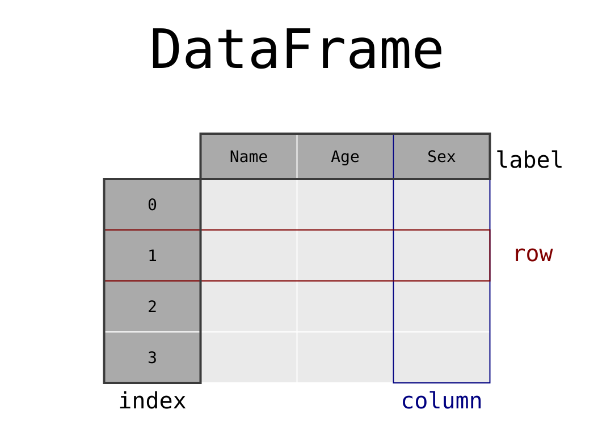

```{r, include=F, warning=F,echo=F}
getwd()

dir.exists(".venv")

library(reticulate)

py_config()


py_install(
  c("pandas", "matplotlib", "yfinance","pathlib","seaborn"),
  pip = TRUE
)

reticulate::py_require(
    c("pandas", "matplotlib", "yfinance","pathlib","seaborn")
)

py_module_available("pandas")
py_module_available("matplotlib")
py_module_available("yfinance")
py_module_available("pathlib")
py_module_available("seaborn")
```

```{python, include=F, warning=F,echo=F}
import numpy as np
import pandas as pd
import matplotlib.pyplot as plt
import yfinance as yf
import pathlib

print("Python OK")
print("NumPy:", np.__version__)
print("Pandas:", pd.__version__)
```


## Readings

- Getting Started with pandas, by Wes McKinney

## Introduction to Pandas

Library features

- DataFrame object for data manipulation with integrated indexing
- Tools for reading and writing data between in-memory data structures and different file formats
- Data alignment and integrated handling of missing data
- Reshaping and pivoting of data sets
- Label-based slicing, fancy indexing, and subsetting of large data sets
- Data structure column insertion and deletion
- Group-by engine allowing split-apply-combine operations on data sets
- Dataset merging and joining
- Hierarchical axis indexing to work with high-dimensional data in a lower-dimensional data structure
- Time series-functionality: date range generation and frequency conversion, moving window statistics, moving window linear regressions, date shifting and lagging

::: {.notes}

Pandas is a software library written for the Python programming language for data manipulation and analysis. In particular, it offers data structures and operations for manipulating numerical tables and time series.

:::

## Introduction to Pandas




## Introduction to Pandas

```{.python}
# import module
import pandas as pd
import pathlib

# Use read_csv to read the CSV file, then df.head() to display a sample of the dataset
file = pathlib.Path("data.csv")
data = pd.read_csv(file,index_col=None, header=0)
ibovespa = data[data["ticker"] == "^BVSP"]
```

```{python}
# Use read_csv to read the CSV file
file = pathlib.Path("data.csv")
data = pd.read_csv(file,index_col=None, header=0)
ibovespa = data[data["ticker"] == "^BVSP"]
```

```{.python}
#The shape property shows the dimensions of the DataFrame
data.shape
```

```{python}
data.shape
```

```{.python}
# The dtypes property gives the datatype of each column:
data.dtypes
```

```{python}
# The dtypes property gives the datatype of each column:
data.dtypes
```

```{.python}
# The info() method gives information about the index, columns, and memory usage:
ibovespa.head()
```

```{.python}
# df.head() displays a sample of the dataset 
ibovespa.head()
```

```{python}
ibovespa.head()
```

```{.python}
ibovespa.tail()
```

```{python}
ibovespa.tail()
```

## Introduction to Pandas

```{.python}
# DataFrame has two important properties: index and column
ibovespa.index
```

```{python}
# DataFrame has two important properties: index and column.
ibovespa.index
```

```{.python}
ibovespa.columns
```

```{python}
# DataFrame has two important properties: index and column.
ibovespa.columns
```

```{.python}
# The dtypes property gives the datatype of each column:
ibovespa.dtypes
```

```{python}
ibovespa.dtypes
```
```{.python}
# When you assign to a new column name, it adds the column to the end of the DataFrame
ibovespa["class"] = "Equity" 
ibovespa.head()
```

```{python}
ibovespa["class"] = "Equity" 
ibovespa.head()
```

## Introduction to Pandas

```{.python}
# Use df.drop() to delete a column:
ibovespa.drop("class", axis=1, inplace=True)
ibovespa.head()
```

```{python}
ibovespa.drop("class", axis=1, inplace=True)
ibovespa.head()
```

```{.python}
# You can use a dictionary mapping to rename columns
ibovespa.rename(columns={"cumret_adjusted_prices":"Cumulative Returns"}, inplace=True)
ibovespa.head()
```

```{python}
# You can use a dictionary mapping to rename columns
ibovespa.rename(columns={"cumret_adjusted_prices":"Cumulative Returns"}, inplace=True)
ibovespa.head()
```

## Introduction to Pandas

```{.python}
# To get a column as a Series, use the column header in brackets:
ibovespa["Cumulative Returns"].head()
```

```{python}
# To get a column as a Series, use the column header in brackets:
ibovespa["Cumulative Returns"].head()
```

```{.python}
# To get a column as a Series, use the column header in brackets:
ibovespa["Cumulative Returns"].head()
```

```{python}
# To get a column as a Series, use the column header in brackets:
ibovespa[["Cumulative Returns"]].head()
```

## Introduction to Pandas

```{.python}
# For multiple columns, put a list inside the brackets (so two sets of brackets):
ibovespa[["ref_date", "Cumulative Returns"]].head()
```

```{python}
# For multiple columns, put a list inside the brackets (so two sets of brackets):
ibovespa[["ref_date", "Cumulative Returns"]].head()
```


```{python}
ibovespa[["ref_date", "Cumulative Returns"]]
```


```{.python}
# The describe() method returns basic statistics for all numeric columns:
ibovespa.describe()
```

```{python}
# The describe() method returns basic statistics for all numeric columns:
ibovespa.describe()
```

## Introduction to Pandas

```{.python}
data.loc[[1,30]]
```

```{python}
data.loc[[1,30]]
```


```{python}
ibovespa.transpose()
```


```{python}
ibovespa.set_index("ref_date")
```

```{python}
time = pd.to_datetime(ibovespa["ref_date"])

ibovespa["ref_date"] = time

ibovespa.dtypes
```

## Data Cleaning and Preparation

```{python}

```


