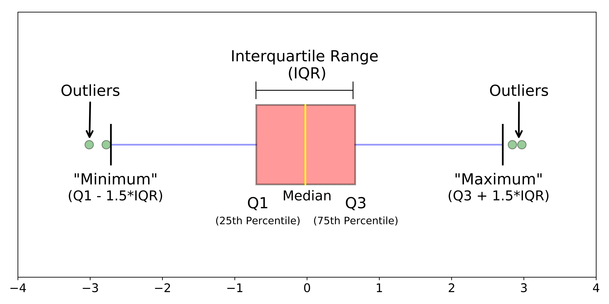

```{r}
library(yfR)
library(tidyverse)

tickers = c(
    "ABEV3.SA", "ALOS3.SA", "ASAI3.SA", "B3SA3.SA",
    "BBAS3.SA", "BBDC3.SA", "BBDC4.SA", "BBSE3.SA", "BEEF3.SA",
    "BPAC11.SA", "BRAP4.SA", "BRAV3.SA", "BRFS3.SA", "BRKM5.SA",
    "CCRO3.SA", "CMIG4.SA", "CMIN3.SA", "COGN3.SA", "CPFE3.SA",
    "CPLE6.SA", "CRFB3.SA", "CSAN3.SA", "CSNA3.SA", "CVCB3.SA",
    "CXSE3.SA", "CYRE3.SA", "ELET3.SA", "ELET6.SA", "EMBR3.SA",
    "ENEV3.SA", "ENGI11.SA", "EQTL3.SA", "EZTC3.SA", "FLRY3.SA",
    "GGBR4.SA", "GOAU4.SA", "HAPV3.SA", "HYPE3.SA", "IGTI11.SA",
    "IRBR3.SA", "ISAE4.SA", "ITSA4.SA", "ITUB4.SA", "JBSS3.SA",
    "KLBN11.SA", "LREN3.SA", "MGLU3.SA", "MRFG3.SA", "MRVE3.SA",
    "MULT3.SA", "NTCO3.SA", "PCAR3.SA", "PETR3.SA", "PETR4.SA",
    "PETZ3.SA", "PRIO3.SA", "RADL3.SA", "RAIL3.SA", "RAIZ4.SA",
    "RDOR3.SA", "RECV3.SA", "RENT3.SA", "RRRP3.SA", "SANB11.SA",
    "SBSP3.SA", "SLCE3.SA", "SMTO3.SA", "SUZB3.SA", "TAEE11.SA",
    "TIMS3.SA", "TOTS3.SA", "UGPA3.SA", "USIM5.SA", "VALE3.SA",
    "VAMO3.SA", "VBBR3.SA", "WEGE3.SA", "YDUQ3.SA","^BVSP"
)

dados = yfR::yf_get(
  first_date = as.Date("2020-01-01"),
  last_date = Sys.Date(),
  tickers = tickers,
  bench_ticker = "^BVSP"
)
```

# Introduction

Exploratory Data Analysis are fundamental

In todays lecture, we will learn about 

- Measures of position

- Measures of dispersion

- Measures of shape

- Bivariate measures

These will enable us to expand towards the data

# Measures of position

**Measures of position** summarize where the data are located or concentrated.

```{r}
dados_media <- dados |>
  filter(ticker == tickers[1]) %>% 
  filter(
    !is.na(ret_adjusted_prices),
    is.finite(ret_adjusted_prices)
  ) |>
  mutate(
    year = as.integer(format(ref_date, "%Y"))
  )

media_global <- dados_media |>
  summarise(
    mean_return = mean(ret_adjusted_prices)
  ) |>
  pull(mean_return)

media_anual <- dados_media |>
  group_by(year) |>
  summarise(
    mean_return = mean(ret_adjusted_prices),
    standard_deviation = sd(ret_adjusted_prices),
    n = n(),
    standard_error = standard_deviation / sqrt(n),
    lower_bound = mean_return - 1.96 * standard_error,
    upper_bound = mean_return + 1.96 * standard_error,
    .groups = "drop"
  ) |>
  mutate(
    direction = if_else(
      mean_return >= 0,
      "Positive",
      "Negative"
    ),
    relative_to_global = case_when(
      mean_return > media_global ~ "Above global mean",
      mean_return < media_global ~ "Below global mean",
      TRUE ~ "Equal to global mean"
    ),
    highlight = case_when(
      mean_return == max(mean_return) ~ "Highest annual mean",
      mean_return == min(mean_return) ~ "Lowest annual mean",
      TRUE ~ ""
    )
  )
ggplot(
  media_anual,
  aes(
    x = mean_return,
    y = factor(year)
  )
) +
  geom_vline(
    xintercept = 0,
    color = "grey35",
    linewidth = 0.6
  ) +
  geom_vline(
    xintercept = media_global,
    color = "#7030A0",
    linetype = "dashed",
    linewidth = 0.9
  ) +
  geom_errorbarh(
    aes(
      xmin = lower_bound,
      xmax = upper_bound
    ),
    height = 0,
    linewidth = 0.7,
    color = "grey55"
  ) +
  geom_segment(
    aes(
      x = 0,
      xend = mean_return,
      yend = factor(year),
      color = direction
    ),
    linewidth = 1.1,
    alpha = 0.55
  ) +
  geom_point(
    aes(color = direction),
    size = 4
  ) +
  geom_text(
    aes(
      label = scales::percent(
        mean_return,
        accuracy = 0.001
      )
    ),
    hjust = ifelse(
      media_anual$mean_return >= 0,
      -0.25,
      1.25
    ),
    size = 3.8,
    fontface = "bold"
  ) +
  scale_color_manual(
    values = c(
      "Positive" = "#2E7D32",
      "Negative" = "#C62828"
    )
  ) +
  scale_x_continuous(
    labels = scales::label_percent(
      accuracy = 0.01
    ),
    expand = expansion(mult = c(0.15, 0.15))
  ) +
  labs(
    title = "Average daily returns vary across years",
    subtitle = paste0(
      "Dashed line represents the global mean: ",
      scales::percent(
        media_global,
        accuracy = 0.001
      )
    ),
    x = "Average daily adjusted return",
    y = NULL,
    color = NULL,
    caption = paste(
      "Points represent annual means.",
      "Horizontal intervals are approximate 95% confidence intervals."
    )
  ) +
  theme_minimal(base_size = 13) +
  theme(
    plot.title = element_text(
      size = 20,
      face = "bold"
    ),
    plot.subtitle = element_text(
      size = 11,
      color = "grey30"
    ),
    axis.text.y = element_text(
      size = 11,
      face = "bold"
    ),
    panel.grid.major.y = element_blank(),
    panel.grid.minor = element_blank(),
    legend.position = "bottom",
    plot.caption = element_text(
      color = "grey40",
      hjust = 0
    )
  )
```


```{r}
retornos <- dados |>
  filter(ticker == tickers[1]) %>% 
  filter(
    !is.na(ret_adjusted_prices),
    is.finite(ret_adjusted_prices)
  ) |>
  pull(ret_adjusted_prices)

media <- mean(retornos)
mediana <- median(retornos)

densidade <- density(retornos)

moda_estimada <- densidade$x[
  which.max(densidade$y)
]

limites_x <- quantile(
  retornos,
  probs = c(0.01, 0.99)
)

ggplot(
  data.frame(retorno = retornos),
  aes(x = retorno)
) +
  geom_density(
    fill = "#4472C4",
    color = "#2F5597",
    alpha = 0.30,
    linewidth = 1
  ) +
  geom_vline(
    xintercept = media,
    color = "#00B050",
    linewidth = 1
  ) +
  geom_vline(
    xintercept = mediana,
    color = "#C00000",
    linewidth = 1,
    linetype = "dashed"
  ) +
  geom_vline(
    xintercept = moda_estimada,
    color = "#7030A0",
    linewidth = 1,
    linetype = "dotted"
  ) +
  annotate(
    "text",
    x = media,
    y = Inf,
    label = "Mean",
    color = "#00B050",
    angle = 90,
    vjust = 2,
    hjust = 1.1,
    fontface = "bold"
  ) +
  annotate(
    "text",
    x = mediana,
    y = Inf,
    label = "Median",
    color = "#C00000",
    angle = 90,
    vjust = 1,
    hjust = 1.1,
    fontface = "bold"
  ) +
  annotate(
    "text",
    x = moda_estimada,
    y = Inf,
    label = "Mode",
    color = "#7030A0",
    angle = 90,
    vjust = 0.0,
    hjust = 1.1,
    fontface = "bold"
  ) +
  coord_cartesian(xlim = limites_x) +
  scale_x_continuous(
    labels = scales::label_percent(accuracy = 0.1)
  ) +
  labs(
    title = "Where are the returns located?",
    subtitle = "Mean, median and mode provide different definitions of a typical return",
    x = "Daily adjusted return",
    y = "Density"
  ) +
  theme_minimal(base_size = 13) +
  theme(
    panel.grid.minor = element_blank(),
    plot.title = element_text(face = "bold"),
    axis.title.y = element_blank(),
    axis.text.y = element_blank(),
    axis.ticks.y = element_blank()
  )
```

::: {.notes}

They answer questions such as:

- What is the typical value?
- Where is the center of the distribution?
- What value separates the lower and upper parts of the data?
- How high or low is a value relative to the historical distribution?

The main measures of position are the mean, median, and mode

Each measure captures a different notion of “central” or “typical” behavior.

:::

## Mean

The sample **mean** is the sum of observations divided by the number of observations.

$$
\bar{X} = \frac{x_1 + x_2 + \cdots x_n}{n} = \frac{1}{n}\sum_{i=1}^{n} x_i
$$
Where $\bar{X}$ is the mean; $x_i$ is observation $i$; and $n$ is the number of observations.


<!-- Other mean variations that worth mention are -->

<!-- - **Weighted mean**: $\bar{X}_w = \frac{\sum_{i=1}^{n} w_i x_i}{\sum_{i=1}^{n} w_i}$ -->

<!-- - **Geometric mean**: $G = \left(\prod_{i=1}^{n} x_i\right)^{1/n} = \exp\left(\frac{1}{n}\sum_{i=1}^{n}\ln(x_i)\right)$ -->

<!-- - **Harmonic mean**: $H = \frac{n}{\sum_{i=1}^{n}\frac{1}{x_i}}$ -->

::: {.notes}

The arithmetic mean represents the average level of the data. In financial and economic data, it may be used to summarize:

- average price; average spread; average return; However, it is sensitive to extreme values.

The geometric mean is especially useful for growth rates and compounded returns. This is useful when evaluating:

- compounded returns; average growth rates; cumulative performance;

:::

```{r}
library(dplyr)
library(ggplot2)

dados_media <- dados |>
  filter(ticker == tickers[1]) %>% 
  filter(
    !is.na(ret_adjusted_prices),
    is.finite(ret_adjusted_prices)
  ) |>
  mutate(
    year = as.integer(format(ref_date, "%Y"))
  )

media_global <- dados_media |>
  summarise(
    mean_return = mean(ret_adjusted_prices)
  ) |>
  pull(mean_return)

media_anual <- dados_media |>
  group_by(year) |>
  summarise(
    mean_return = mean(ret_adjusted_prices),
    standard_deviation = sd(ret_adjusted_prices),
    n = n(),
    standard_error = standard_deviation / sqrt(n),
    lower_bound = mean_return - 1.96 * standard_error,
    upper_bound = mean_return + 1.96 * standard_error,
    .groups = "drop"
  ) |>
  mutate(
    direction = if_else(
      mean_return >= 0,
      "Positive",
      "Negative"
    ),
    relative_to_global = case_when(
      mean_return > media_global ~ "Above global mean",
      mean_return < media_global ~ "Below global mean",
      TRUE ~ "Equal to global mean"
    ),
    highlight = case_when(
      mean_return == max(mean_return) ~ "Highest annual mean",
      mean_return == min(mean_return) ~ "Lowest annual mean",
      TRUE ~ ""
    )
  )
ggplot(
  media_anual,
  aes(
    x = mean_return,
    y = factor(year)
  )
) +
  geom_vline(
    xintercept = 0,
    color = "grey35",
    linewidth = 0.6
  ) +
  geom_vline(
    xintercept = media_global,
    color = "#7030A0",
    linetype = "dashed",
    linewidth = 0.9
  ) +
  geom_errorbarh(
    aes(
      xmin = lower_bound,
      xmax = upper_bound
    ),
    height = 0,
    linewidth = 0.7,
    color = "grey55"
  ) +
  geom_segment(
    aes(
      x = 0,
      xend = mean_return,
      yend = factor(year),
      color = direction
    ),
    linewidth = 1.1,
    alpha = 0.55
  ) +
  geom_point(
    aes(color = direction),
    size = 4
  ) +
  geom_text(
    aes(
      label = scales::percent(
        mean_return,
        accuracy = 0.001
      )
    ),
    hjust = ifelse(
      media_anual$mean_return >= 0,
      -0.25,
      1.25
    ),
    size = 3.8,
    fontface = "bold"
  ) +
  scale_color_manual(
    values = c(
      "Positive" = "#2E7D32",
      "Negative" = "#C62828"
    )
  ) +
  scale_x_continuous(
    labels = scales::label_percent(
      accuracy = 0.01
    ),
    expand = expansion(mult = c(0.15, 0.15))
  ) +
  labs(
    title = "Average daily returns vary across years",
    subtitle = paste0(
      "Dashed line represents the global mean: ",
      scales::percent(
        media_global,
        accuracy = 0.001
      )
    ),
    x = "Average daily adjusted return",
    y = NULL,
    color = NULL,
    caption = paste(
      "Points represent annual means.",
      "Horizontal intervals are approximate 95% confidence intervals."
    )
  ) +
  theme_minimal(base_size = 13) +
  theme(
    plot.title = element_text(
      size = 20,
      face = "bold"
    ),
    plot.subtitle = element_text(
      size = 11,
      color = "grey30"
    ),
    axis.text.y = element_text(
      size = 11,
      face = "bold"
    ),
    panel.grid.major.y = element_blank(),
    panel.grid.minor = element_blank(),
    legend.position = "bottom",
    plot.caption = element_text(
      color = "grey40",
      hjust = 0
    )
  )
```


<!-- <!-- ### Mean --> -->

<!-- <!-- ```{r} --> -->
<!-- <!-- dados %>% --> -->
<!-- <!--   mutate( --> -->
<!-- <!--     year = lubridate::year(ref_date) --> -->
<!-- <!--   ) %>% --> -->
<!-- <!--   group_by(ticker,year) %>% --> -->
<!-- <!--   reframe( --> -->
<!-- <!--     arithmetic = 100*mean(ret_adjusted_prices, na.rm = TRUE), --> -->
<!-- <!--     geometric = 100*(prod(1+ret_adjusted_prices, na.rm = TRUE)^(1/n())-1), --> -->
<!-- <!--     harmonic = 100*(n()/sum(1/ret_adjusted_prices, na.rm = TRUE)), --> -->
<!-- <!--     weighted = 100*(weighted.mean(ret_adjusted_prices,1:n()/n())) --> -->
<!-- <!--     ) %>% --> -->
<!-- <!--   ggplot() + --> -->
<!-- <!--   geom_point(aes(x = year, y = geometric, color = year)) --> -->


<!-- <!-- ``` --> -->


<!-- <!-- ```{r} --> -->
<!-- <!-- dados %>% --> -->
<!-- <!--   mutate( --> -->
<!-- <!--     year = lubridate::year(ref_date) --> -->
<!-- <!--   ) %>% --> -->
<!-- <!--   group_by(ticker,year) %>% --> -->
<!-- <!--   reframe( --> -->
<!-- <!--     arithmetic = 100*mean(ret_adjusted_prices, na.rm = TRUE), --> -->
<!-- <!--     geometric = 100*(prod(1+ret_adjusted_prices, na.rm = TRUE)^(1/n())-1), --> -->
<!-- <!--     harmonic = 100*(n()/sum(1/ret_adjusted_prices, na.rm = TRUE)), --> -->
<!-- <!--     weighted = 100*(weighted.mean(ret_adjusted_prices,1:n()/n())) --> -->
<!-- <!--     ) %>% --> -->
<!-- <!--   filter(year == 2025) %>%  --> -->
<!-- <!--   filter(ticker %in% tickers[1:5]) %>%  --> -->
<!-- <!--   arrange(desc(arithmetic)) %>%  --> -->
<!-- <!--   knitr::kable(digits = 4, caption = "Average return comparison") --> -->
<!-- <!-- ``` --> -->

<!-- <!-- - Rule of thumb: $H \leq G \leq \bar{X}$ --> -->

<!-- <!-- ## Quantile --> -->

<!-- Let $X_1, X_2, \ldots, X_n$ be a random sample, and let $\widehat{F}_n(x)$ denote its empirical cumulative distribution function $\hat{F}_n(x) = \frac{1}{n} \sum_{i=1}^{n} \mathbf{1}\{X_i \leq x\}$. -->

<!-- The **sample quantile of order** $p$, for $0 < p < 1$, is defined as -->
<!-- $$ -->
<!-- \widehat{Q}_n(p) -->
<!-- = -->
<!-- \widehat{F}_n^{-1}(p) -->
<!-- = -->
<!-- \inf\left\{ -->
<!-- x \in \mathbb{R} : -->
<!-- \widehat{F}_n(x) \geq p -->
<!-- \right\} -->
<!-- $$ -->

<!-- <!-- Quantile that worth mention are --> -->

<!-- <!-- - **Median**: $\text{Median} = q_{0.5}$ --> -->

<!-- <!-- - **1st Quartile**: $\text{Q}_1 = q_{0.25}$ --> -->

<!-- <!-- - **3rd Quartile**: $\text{Q}_3 = q_{0.75}$ --> -->

<!-- <!-- - **1st Percentile**: $\text{P}_1 = q_{0.01}$ --> -->

<!-- <!-- - **99th Percentile**: $\text{P}_{99} = q_{0.99}$ --> -->

<!-- <!-- ::: {.notes} --> -->

<!-- <!-- A **quantile** divides the ordered data into intervals containing equal proportions of observations. --> -->
<!-- <!-- In words, $\widehat{Q}_n(p)$ is the smallest observed value for which the proportion of sample observations less than or equal to that value is at least $p$. --> -->

<!-- <!-- If $X_{(1)} \leq X_{(2)} \leq \cdots \leq X_{(n)}$ are the ordered sample observations, the quantile defined through the inverse empirical CDF is --> -->

<!-- <!-- $$ --> -->
<!-- <!-- \widehat{Q}_n(p) = X_{(\lceil np \rceil)}. --> -->
<!-- <!-- $$ --> -->

<!-- <!-- ::: --> -->

<!-- <!-- ### Quantile --> -->

<!-- <!-- ```{r} --> -->
<!-- <!-- dados %>% --> -->
<!-- <!--   mutate( --> -->
<!-- <!--     year = lubridate::year(ref_date) --> -->
<!-- <!--   ) %>% --> -->
<!-- <!--   filter(year == 2025) %>%  --> -->
<!-- <!--   filter(ticker %in% tickers[1]) %>%  --> -->
<!-- <!--   drop_na() %>% --> -->
<!-- <!--   ungroup() %>%  --> -->
<!-- <!--   mutate(cdf = sapply(sort(ret_adjusted_prices), function(x) sum(ret_adjusted_prices <= x) / length(ret_adjusted_prices))) %>%  --> -->
<!-- <!--   ggplot() + --> -->
<!-- <!--   geom_line(aes(x = sort(ret_adjusted_prices),y = cdf)) + --> -->
<!-- <!--   labs(x = "Yt", y = "F(y)")  --> -->
<!-- <!-- ``` --> -->

<!-- <!-- ```{r} --> -->
<!-- <!-- dados %>% --> -->
<!-- <!--   mutate( --> -->
<!-- <!--     year = lubridate::year(ref_date) --> -->
<!-- <!--   ) %>% --> -->
<!-- <!--   filter(year == 2025) %>%  --> -->
<!-- <!--   filter(ticker %in% tickers[1]) %>%  --> -->
<!-- <!--   drop_na() %>% --> -->
<!-- <!--   ungroup() %>%  --> -->
<!-- <!--   reframe( --> -->
<!-- <!--     alpha = seq(0,1,0.0025), --> -->
<!-- <!--     quantile = sapply(alpha, function(x) quantile(ret_adjusted_prices,x)))  %>%  --> -->
<!-- <!--   ggplot() + --> -->
<!-- <!--   geom_line(aes(x = alpha, y = quantile)) + --> -->
<!-- <!--   labs(x = "alpha", y = "F-1(y)")  --> -->
<!-- <!-- ``` --> -->

<!-- <!-- ### Quantile  --> -->

<!-- <!-- ```{r} --> -->
<!-- <!-- dados %>% --> -->
<!-- <!--   mutate( --> -->
<!-- <!--     year = lubridate::year(ref_date), --> -->
<!-- <!--     ret_adjusted_prices = 100*ret_adjusted_prices, --> -->
<!-- <!--   ) %>% --> -->
<!-- <!--   group_by(ticker,year) %>% --> -->
<!-- <!--   reframe( --> -->
<!-- <!--     percentile_01 = quantile(ret_adjusted_prices, prob = 0.01, na.rm = T), --> -->
<!-- <!--     Q1 = quantile(ret_adjusted_prices, prob = 0.25, na.rm = T), --> -->
<!-- <!--     median = quantile(ret_adjusted_prices, prob = 0.5, na.rm = T), --> -->
<!-- <!--     Q3 = quantile(ret_adjusted_prices, prob = 0.75, na.rm = T), --> -->
<!-- <!--     percentile_99 = quantile(ret_adjusted_prices, prob = 0.99, na.rm = T), --> -->
<!-- <!--     ) %>% --> -->
<!-- <!--   filter(year == 2025) %>%  --> -->
<!-- <!--   filter(ticker %in% tickers[1:5]) %>%  --> -->
<!-- <!--   arrange(desc(median)) %>%  --> -->
<!-- <!--   knitr::kable(digits = 4, caption = "Quantile comparison") --> -->
<!-- <!-- ``` --> -->

<!-- <!-- ## Mode --> -->

<!-- <!-- The **mode** is the most frequent value in the dataset. --> -->

<!-- <!-- For a variable $X$, the mode is: --> -->

<!-- <!-- $$ --> -->
<!-- <!-- \text{Mode}(X) = \arg\max_x f(x) --> -->
<!-- <!-- $$ --> -->

<!-- <!-- Where: --> -->

<!-- <!-- - $f(x)$ is the frequency of value $x$; --> -->
<!-- <!-- - $\arg\max_x f(x)$ is the value that maximizes frequency. --> -->

<!-- <!-- --- --> -->

<!-- <!-- ### Mode --> -->

<!-- <!-- ```{r} --> -->
<!-- <!-- # dados |> --> -->
<!-- <!-- #   filter(!is.na(ret_adjusted_prices)) |> --> -->
<!-- <!-- #   mutate( --> -->
<!-- <!-- #   year = lubridate::year(ref_date), --> -->
<!-- <!-- #   # retorno_arredondado = round(ret_adjusted_prices, digits = 3)) |> --> -->
<!-- <!-- #   group_by(ticker,year) %>%  --> -->
<!-- <!-- #   count(ret, name = "frequency") |> --> -->
<!-- <!-- #   filter(frequency == max(frequency)) |> --> -->
<!-- <!-- #   arrange(desc(retorno_arredondado)) %>%  --> -->
<!-- <!-- #   filter(year == 2025) %>%  --> -->
<!-- <!-- #   filter(ticker %in% tickers[1:5]) %>%  --> -->
<!-- <!-- #   knitr::kable(digits = 4, caption = "Average return comparison")   --> -->

<!-- <!-- dados |> --> -->
<!-- <!--   filter(!is.na(ret_adjusted_prices)) |> --> -->
<!-- <!--   mutate( --> -->
<!-- <!--   year = lubridate::year(ref_date)) |> --> -->
<!-- <!--   group_by(ticker,year) %>%  --> -->
<!-- <!--   reframe(mode = DescTools::Mode(ret_adjusted_prices)) --> -->


<!-- <!-- # Moda exata --> -->
<!-- <!-- dados |> --> -->
<!-- <!--   filter(!is.na(ret_adjusted_prices)) |> --> -->
<!-- <!--   count(ret_adjusted_prices) |> --> -->
<!-- <!--   filter(n == max(n)) --> -->

<!-- <!-- # Moda após discretizaçãO --> -->
<!-- <!-- dados %>%  --> -->
<!-- <!-- filter(!is.na(ret_adjusted_prices)) |> --> -->
<!-- <!-- mutate(retorno_arredondado = round(ret_adjusted_prices, 4)) |> --> -->
<!-- <!-- count(retorno_arredondado) |> --> -->
<!-- <!-- filter(n == max(n)) --> -->

<!-- <!-- ``` --> -->


<!-- <!-- ::: {.notes} --> -->

<!-- <!-- The mode answers: --> -->

<!-- <!-- > Which value occurs most frequently? --> -->

<!-- <!-- It is especially useful for categorical or discrete variables. --> -->

<!-- <!-- Examples: --> -->

<!-- <!-- - most frequent product; --> -->
<!-- <!-- - most common market; --> -->
<!-- <!-- - most common valuation type; --> -->
<!-- <!-- - most frequently observed maturity. --> -->

<!-- <!-- For continuous variables, the mode is often interpreted through histograms or density estimates. --> -->

<!-- <!-- ::: --> -->

# Measures of dispersion

**Measures of dispersion** describe the variability or uncertainty of the data.

```{r}
library(dplyr)
library(ggplot2)

dispersion_data <- tibble(
  distribution = rep(
    c("Low dispersion", "High dispersion"),
    each = 9
  ),
  value = c(
    # Low dispersion, mean = 0
    -2, -1.5, -1, -0.5, 0, 0.5, 1, 1.5, 2,

    # High dispersion, mean = 0
    -8, -6, -4, -2, 0, 2, 4, 6, 8
  )
) |>
  mutate(
    distribution = factor(
      distribution,
      levels = c(
        "Low dispersion",
        "High dispersion"
      )
    )
  )

ggplot(
  dispersion_data,
  aes(x = value, y = distribution)
) +
  geom_vline(
    xintercept = 0,
    color = "#C00000",
    linetype = "dashed",
    linewidth = 0.9
  ) +
  geom_point(
    size = 5,
    color = "#4472C4",
    alpha = 0.85
  ) +
  annotate(
    "text",
    x = 0,
    y = 2.35,
    label = "Same mean",
    color = "#C00000",
    fontface = "bold",
    size = 4
  ) +
  scale_x_continuous(
    breaks = seq(-8, 8, by = 2),
    limits = c(-9, 9)
  ) +
  labs(
    title = "Same center, different dispersion",
    subtitle = "Dispersion describes how far observations are spread around the center",
    x = "Value",
    y = NULL
  ) +
  theme_minimal(base_size = 14) +
  theme(
    plot.title = element_text(
      face = "bold",
      size = 20
    ),
    plot.subtitle = element_text(
      size = 12,
      color = "grey30"
    ),
    axis.text.y = element_text(
      face = "bold",
      size = 12
    ),
    panel.grid.major.y = element_blank(),
    panel.grid.minor = element_blank()
  )
```


::: {.notes}

They answer questions such as:

- How far are observations from the center?
- How volatile is the series?
- How stable are prices, spreads, or returns?
- Are values concentrated or widely dispersed?

:::


<!-- ## Range and Interquartile Range -->

<!-- The **range** measures the distance between the largest and smallest observations. -->

<!-- $$ -->
<!-- R = x_{\max} - x_{\min} -->
<!-- $$ -->

<!-- Where: -->

<!-- - $x_{\max}$ is the maximum value; -->
<!-- - $x_{\min}$ is the minimum value. -->

<!-- The **interquartile range**, or **IQR**, measures the spread of the central 50% of the data. -->

<!-- $$ -->
<!-- IQR = Q_3 - Q_1 -->
<!-- $$ -->

<!-- Where: -->

<!-- - $Q_1$ is the first quartile; -->
<!-- - $Q_3$ is the third quartile. -->

<!-- ::: {.notes} -->

<!-- The range is simple, but highly sensitive to outliers. -->

<!-- The IQR is more robust to outliers than the range. -->

<!-- ::: -->

<!-- ## Boxplot -->

<!-- A boxplot is a graphical representation of the distribution based on its quartiles  -->

<!-- Key components: -->

<!-- - Box: Extends from Q1 to Q3 and contains the middle 50% of the observations. -->
<!-- - Median line: Represents the 50th percentile. -->
<!-- - Interquartile range: IQR = Q3−Q1. -->
<!-- - Whiskers: Extend to the extreme observations within below and above Q1 and Q3. -->

<!--  -->


<!-- ::: {.notes} -->

<!-- Potential outliers: Observations outside the whiskers, usually displayed as individual points. -->

<!-- It summarizes the data through the median, first quartile (Q1), third quartile (Q3), and interquartile range (IQR). The whiskers show the range of typical observations, while values beyond them are displayed as potential outliers. -->

<!-- A boxplot is useful for comparing distributions and identifying central tendency, variability, asymmetry, and potential outliers. -->

<!-- ::: -->

<!-- ### Boxplot -->

<!-- ```{r} -->
<!-- dados %>% -->
<!--   mutate( -->
<!--     year = lubridate::year(ref_date) -->
<!--   ) %>% -->
<!--   group_by(ticker,year) %>%  -->
<!--   filter(year == 2025) %>%  -->
<!--   filter(ticker %in% tickers[1:5]) %>%  -->
<!--   ggplot()+ -->
<!--   geom_boxplot(aes(x = ticker, y = 100*ret_adjusted_prices, color = ticker)) -->
<!-- ``` -->

<!-- ## Variance and Standard Deviation -->

<!-- The **sample variance** measures the average squared deviation from the sample mean. -->

<!-- $$ -->
<!-- s^2 = \frac{1}{n-1}\sum_{i=1}^{n}(x_i - \bar{x})^2 -->
<!-- $$ -->

<!-- Where: -->

<!-- - $s^2$ is the sample variance; -->
<!-- - $x_i$ is observation $i$; -->
<!-- - $\bar{x}$ is the sample mean; -->
<!-- - $n$ is the sample size. -->

<!-- The **sample standard deviation** is the square root of the sample variance. -->

<!-- $$ -->
<!-- s = \sqrt{\frac{1}{n-1}\sum_{i=1}^{n}(x_i - \bar{x})^2} -->
<!-- $$ -->

<!-- It is expressed in the same unit as the original variable. -->

<!-- ### Variance and Standard Deviation -->

<!-- ```{r} -->
<!-- dados %>% -->
<!--   mutate( -->
<!--     year = lubridate::year(ref_date) -->
<!--   ) %>% -->
<!--   group_by(ticker,year) %>% -->
<!--   reframe( -->
<!--     variance = var(100*ret_adjusted_prices), -->
<!--     std_dev = sqrt(variance), -->
<!--     ) %>% -->
<!--   filter(year == 2025) %>%  -->
<!--   filter(ticker %in% tickers[1:5]) %>%  -->
<!--   knitr::kable(digits = 4, caption = "Average return comparison") -->
<!-- ``` -->

<!-- ## Coefficient of Variation -->

<!-- The **coefficient of variation**, or **CV**, measures dispersion relative to the mean. -->

<!-- $$ -->
<!-- CV = \frac{s}{\bar{x}} = \frac{\sqrt{\frac{1}{n-1}\sum_{i=1}^{n}(x_i - \bar{x})^2}}{\frac{1}{n}\sum_{i=1}^{n} x_i}  -->
<!-- $$ -->

<!-- ::: {.notes} -->

<!-- As a percentage: -->

<!-- $$ -->
<!-- CV_{\%} = \frac{s}{\bar{x}} \times 100 -->
<!-- $$ -->

<!-- It is useful for comparing variability across series with different levels. -->

<!-- ::: -->

<!-- ## Z-Score -->

<!-- The **z-score** measures how many standard deviations an observation is from the mean. -->

<!-- $$ -->
<!-- z_i = \frac{x_i - \bar{x}}{s} = \frac{x_i - \frac{1}{n}\sum_{i=1}^{n} x_i}{\sqrt{\frac{1}{n-1}\sum_{i=1}^{n}(x_i - \bar{x})^2}}  -->
<!-- $$ -->

<!-- Where: -->

<!-- - $x_i$ is observation $i$; -->
<!-- - $\bar{x}$ is the sample mean; -->
<!-- - $s$ is the sample standard deviation. -->

<!-- --- -->

# Measures of Shape

```{r}
library(dplyr)
library(ggplot2)

set.seed(123)

n <- 10000

normal_data <- rnorm(
  n = n,
  mean = 0,
  sd = 1
)

right_skewed_data <- rexp(
  n = n,
  rate = 1
)

right_skewed_data <- as.numeric(
  scale(right_skewed_data)
)

left_skewed_data <- -right_skewed_data

heavy_tailed_data <- rt(
  n = n,
  df = 4
)

heavy_tailed_data <- as.numeric(
  scale(heavy_tailed_data)
)

shape_data <- bind_rows(
  tibble(
    value = normal_data,
    shape = "Symmetric"
  ),
  tibble(
    value = right_skewed_data,
    shape = "Right-skewed"
  ),
  tibble(
    value = left_skewed_data,
    shape = "Left-skewed"
  ),
  tibble(
    value = heavy_tailed_data,
    shape = "Heavy-tailed"
  )
) |>
  mutate(
    shape = factor(
      shape,
      levels = c(
        "Symmetric",
        "Right-skewed",
        "Left-skewed",
        "Heavy-tailed"
      )
    )
  )

ggplot(
  shape_data,
  aes(x = value)
) +
  geom_density(
    fill = "#4472C4",
    color = "#2F5597",
    alpha = 0.35,
    linewidth = 0.9,
    adjust = 1.1
  ) +
  geom_vline(
    xintercept = 0,
    color = "#C00000",
    linetype = "dashed",
    linewidth = 0.7
  ) +
  facet_wrap(
    ~ shape,
    ncol = 2
  ) +
  coord_cartesian(
    xlim = c(-5, 5)
  ) +
  labs(
    title = "Similar location and scale, different shapes",
    subtitle = paste(
      "Shape describes asymmetry, concentration",
      "and tail behavior"
    ),
    x = "Standardized value",
    y = NULL
  ) +
  theme_minimal(base_size = 14) +
  theme(
    plot.title = element_text(
      face = "bold",
      size = 20
    ),
    strip.text = element_text(
      face = "bold",
      size = 12
    ),
    axis.text.y = element_blank(),
    axis.ticks.y = element_blank(),
    panel.grid.minor = element_blank()
  )
```

<!-- Many measures of shape are based on moments. The $k$-th central moment is: -->

<!-- $$ -->
<!-- \mu_k = E[(X - \mu)^k] -->
<!-- $$ -->

<!-- For a sample, the $k$-th sample central moment is: -->

<!-- $$ -->
<!-- m_k = \frac{1}{n}\sum_{i=1}^{n}(x_i - \bar{x})^k -->
<!-- $$ -->

<!-- Where: -->

<!-- - $k$ is the order of the moment; -->
<!-- - $\bar{x}$ is the sample mean. -->

<!-- The first four moments are commonly associated with: -->

<!-- 1. Mean; -->
<!-- 2. Variance; -->
<!-- 3. Skewness; -->
<!-- 4. Kurtosis. -->

<!-- ::: {.notes} -->

<!-- In exploratory data analysis: -->

<!-- - variance describes dispersion; -->
<!-- - skewness describes asymmetry; -->
<!-- - kurtosis describes tail behavior and peakedness. -->

<!-- ::: -->

<!-- ## Skewness -->

<!-- **Skewness** measures the asymmetry of a distribution. -->

<!-- Population skewness: -->

<!-- $$ -->
<!-- \gamma_1 = \frac{E[(X-\mu)^3]}{\sigma^3} -->
<!-- $$ -->

<!-- Sample skewness: -->

<!-- $$ -->
<!-- g_1 = -->
<!-- \frac{ -->
<!-- \frac{1}{n}\sum_{i=1}^{n}(x_i-\bar{x})^3 -->
<!-- } -->
<!-- { -->
<!-- \left[ -->
<!-- \frac{1}{n}\sum_{i=1}^{n}(x_i-\bar{x})^2 -->
<!-- \right]^{3/2} -->
<!-- } -->
<!-- $$ -->

<!-- ::: {.notes} -->

<!-- If: -->

<!-- $$ -->
<!-- \gamma_1 > 0 -->
<!-- $$ -->

<!-- The distribution is **right-skewed**. -->

<!-- If: -->

<!-- $$ -->
<!-- \gamma_1 < 0 -->
<!-- $$ -->

<!-- The distribution is **left-skewed**. -->

<!-- If: -->

<!-- $$ -->
<!-- \gamma_1 \approx 0 -->
<!-- $$ -->

<!-- The distribution is approximately symmetric. -->

<!-- Right-Skewed Distribution -->

<!-- A right-skewed distribution has a longer right tail. -->

<!-- Usually: -->

<!-- $$ -->
<!-- \text{Mean} > \text{Median} -->
<!-- $$ -->

<!-- In financial data, this may occur when there are occasional large positive observations. -->

<!-- Examples: -->

<!-- - price spikes; -->
<!-- - large positive returns; -->
<!-- - extreme spread widening. -->

<!-- Left-Skewed Distribution -->

<!-- A left-skewed distribution has a longer left tail. -->

<!-- Usually: -->

<!-- $$ -->
<!-- \text{Mean} < \text{Median} -->
<!-- $$ -->

<!-- In financial data, this may occur when there are occasional large negative observations. -->

<!-- Examples: -->

<!-- - sharp price collapses; -->
<!-- - negative returns; -->
<!-- - spread compression events. -->

<!-- ::: -->

<!-- ### Skewness -->


<!-- Mode Median Mean -->


<!-- ## Kurtosis -->

<!-- **Kurtosis** describes tail behavior and the concentration of values around the center. -->

<!-- Population kurtosis: -->

<!-- $$ -->
<!-- \beta_2 = \frac{E[(X-\mu)^4]}{\sigma^4} -->
<!-- $$ -->

<!-- Sample kurtosis: -->

<!-- $$ -->
<!-- g_2 = -->
<!-- \frac{ -->
<!-- \frac{1}{n}\sum_{i=1}^{n}(x_i-\bar{x})^4 -->
<!-- } -->
<!-- { -->
<!-- \left[ -->
<!-- \frac{1}{n}\sum_{i=1}^{n}(x_i-\bar{x})^2 -->
<!-- \right]^2 -->
<!-- } -->
<!-- $$ -->

<!-- ::: {.notes} -->

<!-- Excess kurtosis compares kurtosis to the normal distribution. -->

<!-- $$ -->
<!-- \text{Excess Kurtosis} = \beta_2 - 3 -->
<!-- $$ -->

<!-- For a normal distribution: -->

<!-- $$ -->
<!-- \beta_2 = 3 -->
<!-- $$ -->

<!-- Therefore: -->

<!-- $$ -->
<!-- \text{Excess Kurtosis} = 0 -->
<!-- $$ -->

<!-- If excess kurtosis is positive: -->

<!-- $$ -->
<!-- \text{Excess Kurtosis} > 0 -->
<!-- $$ -->

<!-- The distribution has heavier tails than a normal distribution. -->

<!-- If excess kurtosis is negative: -->

<!-- $$ -->
<!-- \text{Excess Kurtosis} < 0 -->
<!-- $$ -->

<!-- The distribution has lighter tails than a normal distribution. -->

<!-- Financial returns often exhibit positive excess kurtosis. -->

<!-- ::: -->

<!-- ## Histogram -->


<!-- # Bivariate Measures -->

<!-- **Bivariate measures** describe the relationship between two variables. -->

<!-- They help answer questions such as: -->

<!-- - Do two series move together? -->
<!-- - Is the relationship positive or negative? -->
<!-- - Is the relationship linear? -->
<!-- - Is the association monotonic? -->
<!-- - How strong is the relationship? -->
<!-- - How much does one variable change when another changes? -->

<!-- ## Sample Covariance -->

<!-- The **sample covariance** measures whether two variables move together. -->

<!-- $$ -->
<!-- s_{xy} -->
<!-- = -->
<!-- \frac{1}{n-1} -->
<!-- \sum_{i=1}^{n} -->
<!-- (x_i - \bar{x})(y_i - \bar{y}) -->
<!-- $$ -->

<!-- If covariance is positive, the variables tend to move in the same direction. -->

<!-- If covariance is negative, they tend to move in opposite directions. -->

<!-- --- -->


<!-- ## Correlation -->

<!-- The **Pearson correlation coefficient** standardizes covariance. -->

<!-- $$ -->
<!-- r_{xy} -->
<!-- = -->
<!-- \frac{s_{xy}}{s_x s_y} -->
<!-- $$ -->

<!-- Equivalently: -->

<!-- $$ -->
<!-- r_{xy} -->
<!-- = -->
<!-- \frac{ -->
<!-- \sum_{i=1}^{n}(x_i-\bar{x})(y_i-\bar{y}) -->
<!-- } -->
<!-- { -->
<!-- \sqrt{\sum_{i=1}^{n}(x_i-\bar{x})^2} -->
<!-- \sqrt{\sum_{i=1}^{n}(y_i-\bar{y})^2} -->
<!-- } -->
<!-- $$ -->

<!-- --- -->

<!-- ## Lead-Lag Correlation -->

<!-- A lead-lag relationship can be explored using lagged correlation. -->

<!-- $$ -->
<!-- r_{xy}(k) = Corr(X_t, Y_{t-k}) -->
<!-- $$ -->

<!-- Where: -->

<!-- - $k > 0$ compares $X_t$ with past values of $Y$; -->
<!-- - $k < 0$ compares $X_t$ with future values of $Y$. -->

<!-- This helps identify whether one series leads another. -->

<!-- --- -->

<!-- ## Correlation Matrix -->


<!-- ## Exploratory Data Analysis -->

<!-- ```{r} -->
<!-- dados %>% -->
<!--   mutate( -->
<!--     year = lubridate::year(ref_date) -->
<!--   ) %>% -->
<!--   group_by(ticker,year) %>% -->
<!--   reframe( -->
<!--     min = 100*min(ret_adjusted_prices, na.rm = TRUE), -->
<!--     q_25 = 100*quantile(ret_adjusted_prices,0.25, na.rm = TRUE), -->
<!--     median = 100*quantile(ret_adjusted_prices,0.5, na.rm = TRUE), -->
<!--     q_75 = 100*quantile(ret_adjusted_prices,0.75, na.rm = TRUE), -->
<!--     max = 100*max(ret_adjusted_prices, na.rm = TRUE), -->
<!--     range = max - min, -->
<!--     iqr_range = q_75 - q_25, -->
<!--     mean = 100*mean(ret_adjusted_prices, na.rm = TRUE), -->
<!--     variance = var(ret_adjusted_prices), -->
<!--     std_dev = sqrt(variance), -->
<!--     skew = mean(ret_adjusted_prices - mean(ret_adjusted_prices))^3/std_dev^3, -->
<!--     kurt = mean(ret_adjusted_prices - mean(ret_adjusted_prices))^4/std_dev^4 -->
<!--     ) %>% -->
<!--   filter(year == 2025) %>%  -->
<!--   filter(ticker %in% tickers[1:5]) %>%  -->
<!--   knitr::kable(digits = 4, caption = "Exploratory Data Analysis") -->
<!-- ``` -->


<!-- ## Measures of Position and Dispersion in time series -->

<!-- For time series, measures of position can be calculated: -->

<!-- - over the full sample; -->
<!-- - by year; -->
<!-- - by month; -->
<!-- - before and after a structural break; -->
<!-- - over rolling windows; -->
<!-- - by market regime. -->

<!-- Example rolling mean: -->

<!-- $$ -->
<!-- \bar{x}_{t,w} = \frac{1}{w}\sum_{j=0}^{w-1} x_{t-j} -->
<!-- $$ -->

<!-- Where: -->

<!-- - $w$ is the rolling window size; -->
<!-- - $x_{t-j}$ is the observation $j$ periods before time $t$. -->

<!-- --- -->


<!-- # Risco-Retorno -->

<!-- ```{r} -->
<!-- # dados %>%  -->
<!-- #   mutate( -->
<!-- #     year = lubridate::year(ref_date) -->
<!-- #   ) %>%  -->
<!-- #   group_by(ticker,year) %>%  -->
<!-- #   reframe( -->
<!-- #     average_return = 100*mean(ret_adjusted_prices, na.rm = TRUE), -->
<!-- #     geometric_return = 100*(prod(1+ret_adjusted_prices, na.rm = TRUE)^(1/n())-1), -->
<!-- #     annualized_volatility = sd(ret_adjusted_prices, na.rm = TRUE)*sqrt(252), -->
<!-- #     volatility = 100*sd(ret_adjusted_prices, na.rm = TRUE), -->
<!-- #     sharpe = geometric_return/annualized_volatility -->
<!-- #     ) %>%  -->
<!-- #   filter(year == 2025) %>%  -->
<!-- #   ggplot() + -->
<!-- #   geom_point(aes(x = annualized_volatility, y = average_return, color = ifelse(sharpe < 1, "Bad","good"))) + -->
<!-- #   theme(legend.position = "bottom")  -->
<!-- ``` -->

